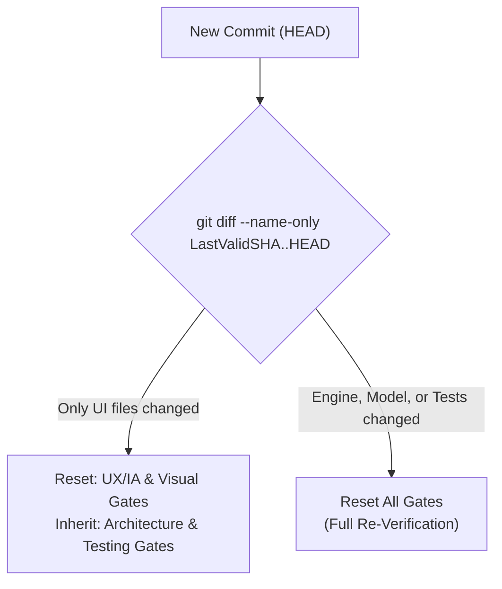

# Design Proposal: Scoped Gate Invalidation for Multi-Pass Loops

**Status:** Proposed
**Author:** Antigravity (AI Pair Programmer)
**Date:** 2026-05-21
**Target System:** [multi-pass-coordinator](file:///Users/maxwilliams/dev/multi-pass-coordinator) & [in-sequence](file:///Users/maxwilliams/dev/in-sequence) OODA loop runners

---

## 1. Context & Background

Under the current Multi-Pass OODA coordination framework, the build loop operates under a strict **Exact-State Gate Policy**. Every review gate—including **Architecture**, **Testing**, **UX/IA**, and **Visual Economy**—must target the exact final commit of a branch before it is considered merge-ready.

If *any* change is committed to the branch, the coordinator resets all validation gates to a stale/pending state.

### The Trigger Event
On `2026-05-21`, the `scene-perform` build loop reached a clean exact commit (`e5fe9ea`) and successfully passed all four review gates. However, a product-owner observation noted that the vertical crossfader orientation in the UI was incorrect and requested a horizontal fader.

The builder fixed this layout in commit `ab62060` by modifying only the view presentation file [ScenesWorkspaceView+Perform.swift](file:///Users/maxwilliams/dev/in-sequence/Sources/UI/Mixer/ScenesWorkspaceView+Perform.swift). Because the commit shifted to `ab62060`:
1. The **UX/IA** and **Visual** gates were correctly invalidated (since the layout changed).
2. The **Architecture** and **Testing** gates were *also* invalidated and forced to queue up for re-evaluation, despite the fact that no business logic, data boundaries, or tests were changed.

---

## 2. The Problem: Inefficiencies of Global Invalidation

While global invalidation is safe, it introduces significant friction in active development loops:

* **Redundant Audits:** The **Architecture Reviewer** must re-read files and confirm that API boundaries are still clean, even for a cosmetic padding or alignment fix. This consumes unnecessary LLM tokens and execution cycles.
* **Build/Pipeline Latency:** Simple presentation-level adjustments (such as changing a color token, correcting a label string, or flipping fader axes) force the build queue to stall while waiting for non-impacted testing and structure gates to re-pass.
* **Test Churn:** Runs of the test suite (`xcodebuild test`) are triggered to prove coverage for code areas that were completely untouched by the UI change.

---

## 3. Proposed Solution: Scoped Gate Invalidation

We propose introducing **Scoped Invalidation** based on path diffs. If the files changed between the last fully-validated commit and the new HEAD fall strictly within a designated "UI/Presentation Only" file filter, the coordinator can **inherit** the pass status of structural gates (Architecture & Testing) while only resetting visual/UX gates.



### 3.1 Directory/Scope Definitions

We can define path scopes in [settings.yaml](file:///Users/maxwilliams/dev/in-sequence/docs/multi-pass-coordinator/settings.yaml) or `multipass.yaml`:

```yaml
invalidation_scopes:
  presentation:
    paths:
      - "Sources/UI/**/*.swift"
      - "Resources/**/*"
    invalidates:
      - ux-ia-review
      - visual-review
    inherits:
      - architecture-review
      - testing-review

  structural:
    paths:
      - "Sources/Engine/**/*"
      - "Sources/Model/**/*"
      - "Tests/**/*"
      - "project.yml"
    invalidates:
      - all # Triggers full reset
```

### 3.2 Evaluation Algorithm

When the coordinator or build-orienter ticks, it checks if a previously validated commit (`LastValidSHA`) exists in the loop manifest. If HEAD has moved:

1. Run `git diff --name-only LastValidSHA..HEAD`.
2. Inspect the list of modified files.
3. If **any** modified file matches a path in the `structural` scope:
   * **Action:** Reset all review gates to `pending`.
4. If **all** modified files match paths within the `presentation` scope:
   * **Action:**
     * Keep `ux-ia-review` and `visual-review` as `pending`.
     * Copy the `pass` status of `architecture-review` and `testing-review` from `LastValidSHA`'s manifest, appending a metadata tag: `inherited: true (from LastValidSHA)`.

> [!IMPORTANT]
> Inheriting is only permitted if the gate actually had a `pass` verdict at `LastValidSHA`. If a gate was failing or unreviewed at `LastValidSHA`, it must remain `pending` or `failed`.

---

## 4. Expected Benefits

* **Velocity Boost:** Simple UI/layout tweaks can be verified and merged in a fraction of the time, as they only require a visual/UX screenshot check.
* **Token/Cost Savings:** Rerunning expensive structural checks (Architecture, full-suite audits) is minimized.
* **Developer Ergonomics:** Reduces loop stagnation when the product owner requests minor visual feedback adjustments.

---

## 5. Potential Risks & Guardrails

| Risk | Mitigating Guardrail |
| :--- | :--- |
| **Silent Swift Compiler Errors** | The project-local build step (`xcodebuild`) must always run and pass on the new HEAD before any gate evaluation. Scoped invalidation only bypasses *reviews*, not compiler syntax verification. |
| **Logic Hidden in Views** | If a builder moves business/engine logic directly into a SwiftUI view initializer, it bypasses the Architecture review. | *Guardrail:* The Architecture review prompt can enforce a static rule that views must not instantiate engine controller states directly. |
| **Broken Gate History** | If `git diff` base selection fails. | *Guardrail:* Default to a full reset if the base commit (`LastValidSHA`) cannot be verified via `git cat-file -e`. |
