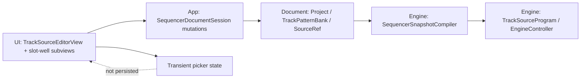
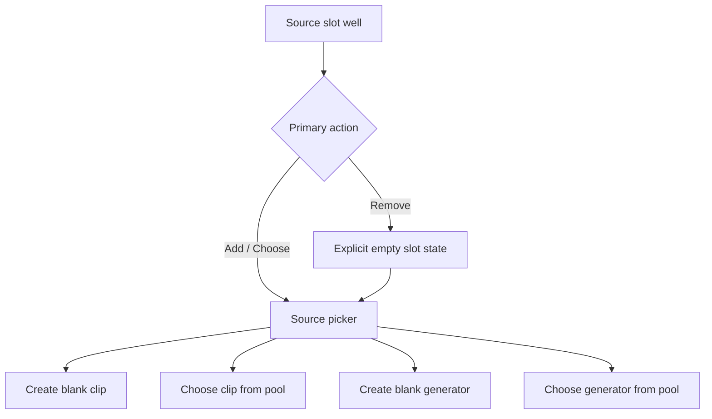

# Modifier Chain Placement — Architecture

This document is the architecture guardrails pass for Modifier Chain Placement.
It draws on `user-stories.md`, `existing-state.md`, `ux-review.md` (accepted on
2026-04-30), `prototype-approval.md` (approved on 2026-05-03), and the wiki
pages for project layout, document model, engine architecture, and architecture
guardrails. It is input for `architecture-review.md`; spec should not be
written until that review accepts the direction.

---

## 1. Application Invariants the Feature Must Preserve

1. **Pattern-slot truth stays slot-scoped.** The approved direction is about
   the selected pattern slot, not about rewriting every slot on the track. Any
   source or modifier mutation triggered from the slot well must target the
   selected `TrackPatternSlot` unless the UI explicitly says "apply to all
   slots." Silent fan-out through bank-wide helpers is out of bounds.

2. **`SourceRef` remains the playback truth.** `SequencerSnapshotCompiler` and
   `TrackSourceProgram` already compile playback from `slot.sourceRef`, not from
   view-local state. The UI must keep using `SourceRef` as the canonical source
   of source mode, clip ID, generator ID, modifier ID, and bypass state. The
   slot well must never become a second source of truth.

3. **An empty source slot uses the existing document shape.** The feature does
   not need a new schema for "empty." The persisted representation is already
   available: `mode == .clip` with `clipID == nil`, while preserving any
   opposite-side IDs needed for later re-engagement. No placeholder clip should
   be auto-created just to make the UI render.

4. **Picker state is transient.** Open/closed picker state, which branch is
   expanded, and progressive-disclosure breadcrumbs are UI runtime state only.
   They do not belong in `Project`, `TrackPatternBank`, or any saved artifact.

5. **Progressive disclosure is a hard IA requirement.** The approval notes are
   explicit: primary slot state and the most likely next action stay visible,
   while pool browsing, secondary creation paths, and empty-pool explanations
   appear only after the user opens the relevant picker branch.

6. **Modifier compatibility stays data-driven.** The modifier slot may only
   surface generators whose `GeneratorKind.supportsModifierStage` is `true`.
   The UI must not duplicate a second compatibility table.

7. **Nil-clip playback remains engine-silent, not UI-special-cased.** The
   existing engine already treats a missing `clipID` as silence. The slot-well
   feature should rely on that contract rather than inventing a parallel "empty
   source preview" playback path.

## 2. Lightweight Data and Runtime Shape

### 2.1 Persisted document data

No new persisted fields are required for this feature.

The persisted shape remains:

- `TrackPatternBank` for the track-level slot collection
- `TrackPatternSlot.sourceRef` for the selected slot's source/modifier truth
- `clipPool` and `generatorPool` as the shared project pools

The only new persisted behavior is making deliberate use of a shape that the
document already supports: a clip-mode slot with `clipID == nil`.

### 2.2 Required document-layer helpers

The current mutation surface is biased toward bank-wide generator attachment and
auto-creating clips. The slot-well UI needs slot-scoped helpers so the UI does
not compose low-level `SourceRef` writes ad hoc.

Recommended helpers in `Sources/Document/Project+TrackSources.swift`:

| Helper | Purpose | Guardrail |
|---|---|---|
| `removeClipSource(trackID:slotIndex:)` | Set the selected slot to explicit empty clip state | Preserve `generatorID`, `modifierGeneratorID`, and bypass fields |
| `ensureClipForSlot(trackID:slotIndex:)` | Create a blank clip only when the user chooses a clip-creation path | Do not auto-run on remove |
| `attachGeneratorToSlot(...)` or equivalent | Create/select a source generator for the selected slot only | Must not rewrite every slot in the bank |
| `setPatternModifierGeneratorID` / `setPatternModifierBypassed` | Keep current modifier APIs | Continue to operate slot-by-slot |

The important rule is architectural, not nominal: the slot-well flow should
call explicit slot-scoped mutations instead of assembling partial document
state in SwiftUI closures.

### 2.3 Transient UI/runtime state

The UI will need short-lived state such as:

- which slot-well tab is open (`source` or `modifier`)
- whether the source or modifier picker is open
- which branch is expanded (`new blank`, `from pool`, `existing generator`,
  etc.)
- transient selection rows inside clip/generator lists

That state belongs in `TrackSourceEditorView` or small helper views beneath it.
It is not shared with the engine and does not survive document save/load.

## 3. Responsibility Boundaries

### UI boundary

The feature should stay inside `Sources/UI/TrackSource/`. The current
`TrackSourceEditorView` is already large; the slot-well pass should prefer
small subviews over adding another long switch ladder. Reasonable seams are:

- source slot-well header/body
- modifier slot-well header/body
- source option picker
- clip-pool picker
- generator-pool picker

### Document boundary

Ownership of musical truth stays in `Sources/Document/`. The document layer
decides how to preserve opposite IDs, how empty clip state is represented, and
how slot-scoped mutations synchronize with the bank.

### Engine boundary

No new playback architecture is required if document truth remains coherent.
The engine already compiles per-slot source state through `TrackSourceProgram`,
including clip, generator, modifier, and bypass branches. The architecture
should therefore avoid any UI-only playback override or "preview source" cache.

## 4. Progressive-Disclosure Flow

The approved prototype direction is correct structurally, but the IA must be
more layered than a flat four-way chooser.

Recommended interaction model:

1. The slot well shows current source/modifier state and one primary affordance
   (`Remove`, `Add`, `Choose`, `Bypass`, etc.).
2. Opening the picker reveals the first decision layer only:
   - source well: create new vs choose existing
   - modifier well: add compatible modifier vs choose existing compatible one
3. Pool browsers and empty-pool messaging appear inside second-level panels or
   sheets only when the user opens those branches.

This keeps the default track editor legible while still supporting the
four-option source story from `user-stories.md`.

The modifier well follows the same shell, but its picker options are constrained
to modifier-compatible generators and bypass/removal remain first-class actions
when occupied.

## 5. Existing Patterns to Follow

1. **Compile from `SourceRef`, not from view-local flags.** The playback path
   already does this correctly.

2. **Reuse compatibility queries.** Source clip and generator lists should come
   from `compatibleClips(for:)`, `compatibleGenerators(for:)`, and
   `compatibleModifierGenerators(for:)`, not from duplicated UI filtering.

3. **Prefer slot-scoped mutation APIs over bank-wide helpers.** The current
   `attachNewGenerator`, `removeAttachedGenerator`, and
   `switchAttachedGenerator` helpers rewrite every slot in a bank. That is the
   wrong ownership level for this feature's selected-slot interactions.

4. **Keep the pattern-slot palette as the slot selector.** The slot well acts
   on the selected slot; it should not replace the palette with a second slot
   navigation model.

5. **Honor file-per-responsibility in UI.** If the implementation needs new
   picker or slot-well views, add focused files under `Sources/UI/TrackSource/`
   instead of expanding `TrackSourceEditorView.swift` into a larger god file.

## 6. Persisted Versus Transient State

| State | Persisted? | Owner |
|---|---|---|
| `SourceRef.mode`, `clipID`, `generatorID`, `modifierGeneratorID`, bypass | Yes | `Project` / `TrackPatternBank` |
| Shared clip pool and generator pool entries | Yes | `Project` |
| Empty-slot picker open/closed state | No | SwiftUI view state |
| Expanded disclosure branch inside a picker | No | SwiftUI view state |
| Temporary list selection while browsing pools | No | SwiftUI view state |

No new app-support file, no preferences state, and no engine runtime cache are
needed for this feature.

## 7. Risks and Architecture Questions

1. **`attachedGeneratorID` is still a bank-level helper field.** Playback truth
   already comes from `SourceRef`, but bypass helpers and some model semantics
   still refer to `TrackPatternBank.attachedGeneratorID`. Spec must decide
   whether that field remains compatibility metadata, becomes derived state, or
   needs a narrower slot-aware replacement. The feature must not let
   `attachedGeneratorID` and `SourceRef.generatorID` diverge silently in ways
   the UI cannot explain.

2. **Auto-open vs explicit plus after remove is still a product choice.** The
   prototype uses the faster auto-open path; the user stories describe remove
   then plus. Architecture should support either without changing document
   semantics.

3. **Blank-generator creation semantics need one narrow path.** Creating a new
   generator from the source slot should add exactly one pool entry and bind it
   to the selected slot. If the easiest implementation route still rewrites the
   whole bank, the design boundary is wrong and should be reconsidered before
   spec.

4. **Empty-pool states must be first-class.** The source and modifier flows
   need coherent behavior when there are no compatible clips or modifiers. The
   architecture should not rely on "hide the button" as the only empty-state
   behavior.

5. **Clip creation must remain explicit.** Removing a clip source should not
   immediately recreate a blank clip behind the scenes. Creation happens only
   when the user chooses a clip path from the picker or starts editing a blank
   clip intentionally.
