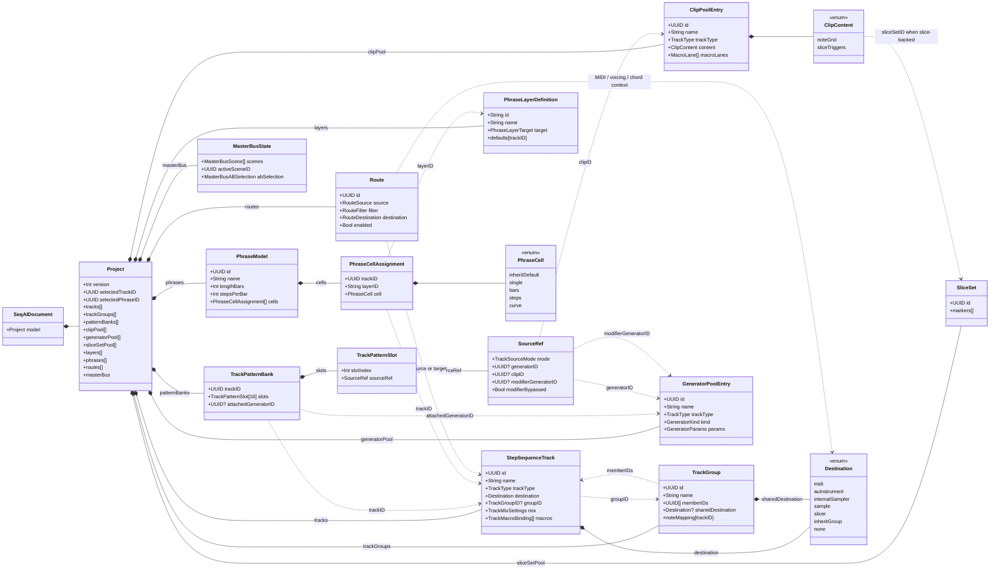
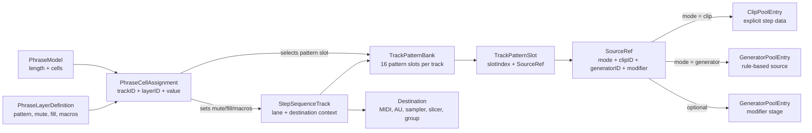
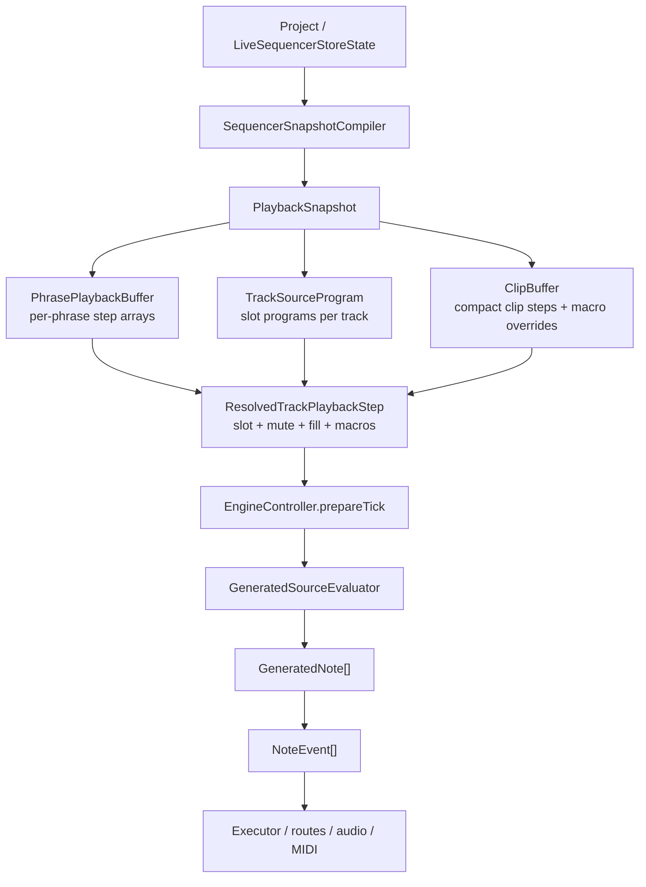

## What Kind Of Diagram Fits?

Different diagrams answer different questions:

- **UML class diagram:** best for "what entities exist, what do they own, and what do they reference?" This is the right default for the document model.
- **ER-style diagram:** best for persisted pools and references, especially `UUID` relationships such as tracks, clips, generators, phrases, routes, and groups.
- **Runtime data-flow diagram:** best for "how does authored state become note events?" This is more useful than UML for the engine hot path.
- **Sequence diagram:** best for one scenario, such as "user toggles fill" or "tick prepares notes for a track."
- **State machine:** best for modes like source slot empty/clip/generator, transport free/song mode, record armed/recording/auditioning/saved, or scene A/B crossfader modes.
- **UX flow / activity diagram:** best for workflows where the pain is interaction sequencing rather than data shape.

For this app, the useful set is: one class/ER hybrid for persisted entities,
one runtime ownership map, one data-flow diagram for playback, one focused
audio graph/routing map, and smaller state machines for specific roadmap
features.

Canonical architecture diagrams now live as D2 source under
`docs/diagrams/src/`, with rendered SVG artifacts under `docs/diagrams/`.
Inline Mermaid remains useful for quick local explanations, but the checked-in
D2 files are the source of truth for system ownership boundaries.

## Canonical D2 Maps

- Persisted entity model:
  `docs/diagrams/src/system-entity-model.d2` renders to
  `docs/diagrams/system-entity-model.svg`.
- Runtime ownership map:
  `docs/diagrams/src/runtime-ownership-map.d2` renders to
  `docs/diagrams/runtime-ownership-map.svg`.
- Playback snapshot path:
  `docs/diagrams/src/playback-snapshot-path.d2` renders to
  `docs/diagrams/playback-snapshot-path.svg`.
- Audio graph routing map:
  `docs/diagrams/src/audio-graph-routing-map.d2` renders to
  `docs/diagrams/audio-graph-routing-map.svg`.

The shared ownership vocabulary lives in
`docs/architecture/runtime-ownership-manifest.yml`. Run
`scripts/diagrams/check-d2-rendered.sh` to verify SVGs match the D2 sources and
`scripts/diagnostics/runtime-ownership-lint.sh` for the first mechanical
runtime-boundary checks.

## Persisted Entity Model

Source: `docs/diagrams/src/system-entity-model.d2`.
Rendered SVG artifact: `docs/diagrams/system-entity-model.svg`.

This diagram is a UML-ish view of the main document entities. Solid diamonds mean "owned in the `.seqai` project." Dashed arrows mean "referenced by ID."

## Source And Phrase Resolution

This diagram shows why the model is split between pattern slots and phrases. A track owns the lane and destination. A pattern slot chooses the source. A phrase chooses which slot and layer values are active over time.

Key invariants:

- A pattern slot can preserve both clip and generator IDs; `SourceRef.mode` decides which one currently plays.
- Phrase state selects pattern slots and performance layers. It does not copy clips or generators.
- Modifier generators process source notes without forking the final note-event path.

## Runtime Snapshot Path

Source: `docs/diagrams/src/playback-snapshot-path.d2`.
Rendered SVG artifact: `docs/diagrams/playback-snapshot-path.svg`.

This diagram is more appropriate than a class diagram for the engine. The important architecture rule is that the tick path reads compiled buffers, not arbitrary SwiftUI or document state.

## When To Add More Diagrams

Add a focused diagram when a feature changes one of these boundaries:

- a new persisted entity or `UUID` relationship;
- a new runtime buffer or hot-path lookup;
- a new state machine, such as clip history auditioning, audio recording, note repeat, or source-slot empty/clip/generator;
- a UX workflow where the sequence of decisions matters more than the entity shape.

Avoid one giant diagram for everything. The codebase is easier to reason about when persistent entities, runtime compilation, and user workflows stay separate.

## Related Pages

- [[application-overview]]
- [[document-model]]
- [[playback-data-path]]
- [[engine-architecture]]
- [[information-architecture-ux]]
- [[architecture-guardrails]]
